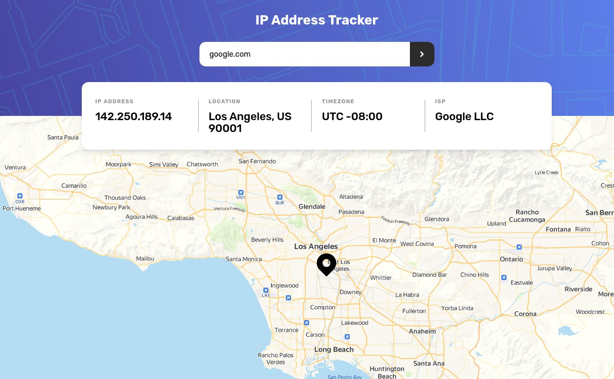

# Frontend Mentor - IP address tracker solution

This is a solution to the [IP address tracker challenge on Frontend Mentor](https://www.frontendmentor.io/challenges/ip-address-tracker-I8-0yYAH0). Frontend Mentor challenges help you improve your coding skills by building realistic projects.

### The challenge

Users should be able to:

- View the optimal layout for each page depending on their device's screen size
- See hover states for all interactive elements on the page
- See their own IP address on the map on the initial page load
- Search for any IP addresses or domains and see the key information and location

### Screenshot

### Links

- [Solution] ()
- [Live Site] (https://fm-ip-address-tracker-rho.vercel.app/)

### Built with

- Next.js
- TypeScript
- Tailwindcss
- NextUI
- Framer Motion

### Author

- Frontend Mentor - [@otr-web-study](https://www.frontendmentor.io/profile/otr-web-study)
